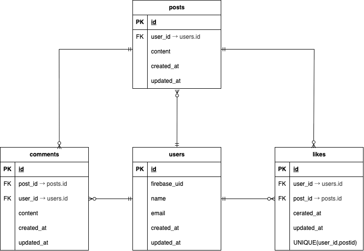

# Share App（仮）

Firebase 認証を用いたシンプルな SNS 風アプリケーションです。  
ユーザーは投稿の作成、削除、いいね、コメントを行うことができます。

フロントエンドは Nuxt（Vue）、バックエンドは Laravel API で構成されており、  
Firebase Authentication と連携した認証処理を実装しています。

< --- トップ画面の画像 ---- >

---

## 作成した目的

- Firebase Authentication と Laravel を連携した実践的な認証処理を理解するため
- REST API を前提としたバックエンド設計・Feature テストの実装経験を積むため
- フロントエンド（Vue/Nuxt）とバックエンド（Laravel）を分離した構成を学ぶため

実務を想定し、  
**ER 図設計 → API 実装 → Feature テスト → Git 管理**  
という一連の開発フローを意識して作成しています。

---

## アプリケーションURL

※ 現在はローカル環境での実行を想定しています  
（デプロイは未実施）

---

## 他のリポジトリ

※ フロントエンド・バックエンドを同一リポジトリで管理しています  
（`frontend / backend` ディレクトリ構成）

---

## 機能一覧

- Firebase Authentication を利用したログイン / 新規登録
- 投稿の一覧表示
- 投稿の作成・削除
- 投稿へのいいね（トグル）
- 投稿へのコメント投稿・一覧表示
- ログイン状態の認証チェック
- Feature Test / Unit Test 実装

---

## 使用技術（実行環境）

### バックエンド
- PHP 8.x
- Laravel 10.x
- Firebase Admin SDK
- SQLite（テスト環境）
- PHPUnit（Feature / Unit Test）

### フロントエンド
- Nuxt 3
- Vue 3（Composition API）
- Firebase Authentication（Client SDK）
- Tailwind CSS

### その他
- Docker（開発環境）
- Git / GitHub

---

## テーブル設計

### users テーブル
- id
- name
- email
- firebase_uid
- timestamps

### posts テーブル
- id
- user_id（FK）
- content
- timestamps

### comments テーブル
- id
- user_id（FK）
- post_id（FK）
- content
- timestamps

### likes テーブル
- id
- user_id（FK）
- post_id（FK）
- timestamps

---

## ER図




---

## 環境構築

### 1. リポジトリをクローン
```
git clone https://github.com/ユーザー名/リポジトリ名.git
cd share-app
```

### 2. バックエンド（Laravel）
```
cd backend
cp .env.example .env
composer install
php artisan key:generate
php artisan migrate
```

### 3. フロントエンド（Nuxt）
```
cd frontend
cp .env.example .env
npm install
npm run dev
```
---

## テスト
```
cd backend
php artisan test
```
#### テストについて
- Firebase 認証のユーザーマッピング処理を Feature Test で検証
- 投稿 / コメント / いいねの CRUD 処理を Feature Test で検証
- モデル間のリレーションを Unit Test で検証

---

## 注意事項
- Firebase の Service Account Key は .gitignore により管理外としています
- テストでは Firebase 認証処理をスタブ化して実行しています
